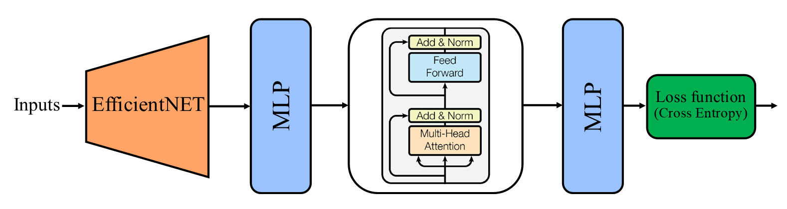

# Covid Detecion
In this repository, we read a dataset of X-ray images, which includes classes: Covid, Normal, Lung Opacity and Viral Pneumonia.
Then we classify the data using different networks such as Cnn, EffiecientNet_V2_S, Swin Transformer and CnnTransformer.
EffiecientNet_V2_S and Swin Transformer networks are trained by fine tune or transfer learning method and Cnn and CnnTransformer networks are trained with initial weights.

## Dataste
The dataset that has been trained and evaluated with that model is the dataset of x-ray images. This dataset contains 25,103 images and includes four classes: Covid, Normal, Lung Opacity and Viral Pneumonia.

21,165 images are related to the <a href='https://www.kaggle.com/datasets/tawsifurrahman/covid19-radiography-database'>COVID-19 Radiography Database</a>, and 317 images are related to the <a href='https://www.kaggle.com/datasets/pranavraikokte/covid19-image-dataset'>Covid-19 Image dataset</a>, and 3,621 images are also related to the <a href='https://www.kaggle.com/datasets/unaissait/curated-chest-xray-image-dataset-for-covid19'>Curated Chest X-Ray Image Dataset for COVID-19</a>.

The reason why images from different datasets were used is to improve the data distribution of each class to avoid biasing the model or network on one of the classes.

## Block Diagram CnnTransformer

## Block Diagram EfficientTransformer

## Results

### Accuracy
|                           |     Train    |     Validation    |     Test    |
|---------------------------|--------------|-------------------|-------------|
|     CnnTransformer        |     0.95     |     0.93          |     0.92    |
|     Cnn                   |     0.92     |     0.91          |     0.89    |
|     EffiecientNet_V2_S    |     0.99     |     0.96          |     0.95    |
|     Swin Transformer      |     0.97     |     0.95          |     0.95    |
|     EfficientTransformer  |     0.98     |     0.96          |     0.96    |

### Loss
|                           |     Train    |     Validation    |     Test    |
|---------------------------|--------------|-------------------|-------------|
|     CnnTransformer        |     0.14     |     0.19          |     0.23    |
|     Cnn                   |     0.24     |     0.25          |     0.3     |
|     EffiecientNet_V2_S    |     0.05     |     0.14          |     0.17    |
|     Swin Transformer      |     0.9      |     0.15          |     0.17    |
|     EfficientTransformer  |     0.4      |     0.13          |     0.13    |

## Number of parameters
|           |     CnnTransformer    |     Cnn      |   EffiecientNet  |     Swin Transformer    |   EfficientTransformer  |
|-----------|-----------------------|--------------|------------------|-------------------------|-------------------------|
|   Params  |     11,276,804        |   1,554,948  |    20,182,612    |     27,522,430          |        6,116,648        |
